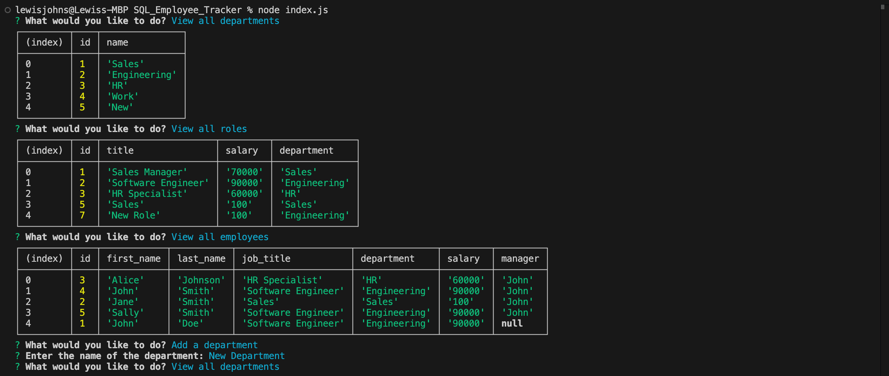

# SQL_Employee_Tracker
This employee tracker application presents the user with the options: view all departments, view all roles, view all employees, add a department, add a role, add an employee, and update an employee role.
The user can view all departments, all roles, and all employees.
When the user chooses to add a new department then they are prompted to enter the name of the department and that department is added to the database
When they choose to add a role, then the user is prompted to enter the name, salary, and department for the role and that role is added to the database.
When the user chooses to add an employee, then they are prompted to enter the employee’s first name, last name, role, and manager, and that employee is added to the database.
And when they choose to update an employee role, then they are prompted to select an employee to update and their new role and this information is updated in the database.
https://app.screencastify.com/v3/watch/JtCDg4siSXhGfZAiYhsy
